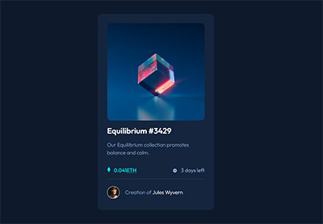
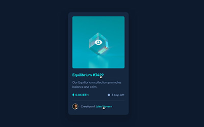

# Frontend Mentor - NFT preview card component solution

This is a solution to the [NFT preview card component challenge on Frontend Mentor](https://www.frontendmentor.io/challenges/nft-preview-card-component-SbdUL_w0U). Frontend Mentor challenges help you improve your coding skills by building realistic projects. 

## Table of contents

- [Overview](#overview)
  - [The challenge](#the-challenge)
  - [Screenshot](#screenshot)
  - [Links](#links)
  
## Overview

### The challenge

Users should be able to:

- View the optimal layout depending on their device's screen size
- See hover states for interactive elements

### Screenshot

|           My Solution            |        Goal         |
|:--------------------------------:|:-------------------:|
|  |  |

### Links

- [Live Site](https://blankztheather.github.io/nft-preview-card)
- [My Submission](https://www.frontendmentor.io/solutions/nft-preview-card-using-scss-and-bem-1EvgPNh8Kb)
